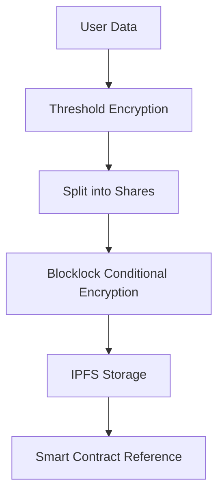
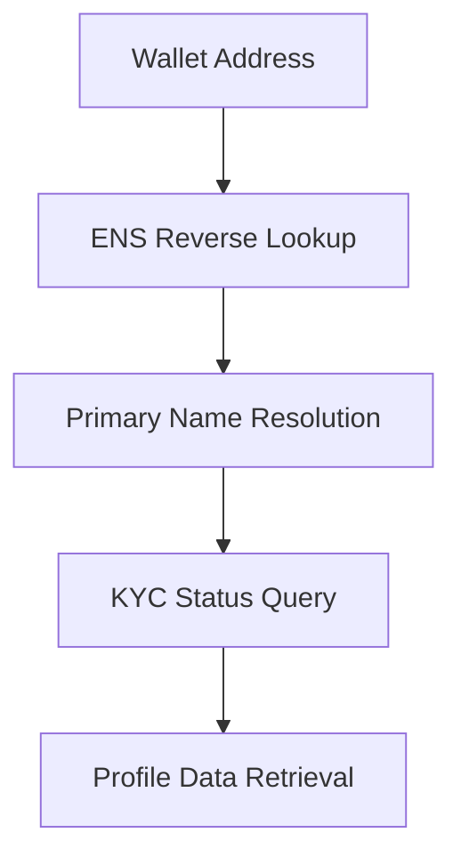

# UniKYC System Flow Documentation

## Architecture Overview

UniKYC implements a decentralized identity verification system using a layered architecture:

```
Frontend (Next.js) → React Hooks → Service Layer → Blockchain & Storage
```

## Core Components

### 1. Frontend Layer
- **Next.js 15** with TypeScript
- **Wagmi & Viem** for Ethereum integration
- **OnchainKit** for wallet connections
- **Tailwind CSS** for styling

### 2. Service Layer
- **KYC Service** (`lib/kyc/service.ts`) - Core business logic
- **ENS Resolver** (`lib/ens/resolver.ts`) - Identity resolution
- **Storage Service** (`lib/storage/storacha.ts`) - IPFS/Filecoin integration
- **Biometric Service** (`lib/auth/biometric.ts`) - WebAuthn integration

### 3. Blockchain Integration
- **Smart Contracts** - Conditional encryption/decryption
- **dcipher Network** - Verifiable randomness and blocklock
- **Multi-chain Support** - Base Sepolia, Filecoin, Polygon

## User Flow

### 1. Wallet Connection
```
User clicks "Verify KYC" → Connect Wallet → ENS Detection → Status Check
```

### 2. KYC Verification Process
```
ENS Input → Document Upload → Personal Info → Threshold Encryption → Biometric Verification → Complete
```

### 3. Data Storage Flow
```
Documents → Threshold Encryption → IPFS Upload → Blocklock Encryption → Smart Contract Storage
```

## Technical Flow

### KYC Button Component Flow
1. **Initial State Check**
   - Check wallet connection
   - Detect ENS name automatically
   - Query existing KYC status

2. **Verification Flow**
   ```typescript
   handleOpenModal() → 
   setLoadingMessage("Checking KYC status...") →
   refetchStatus() →
   determineNextStep() →
   showModal()
   ```

3. **Document Processing**
   - File validation and type checking
   - Threshold encryption (5-of-5, 3-of-5, 2-of-3)
   - IPFS upload via Storacha
   - Content addressing for immutability

4. **Biometric Verification**
   - iProov face verification
   - WebAuthn passkey creation
   - Liveness detection

### Data Encryption Flow



### ENS Integration Flow



## API Endpoints

### Authentication
- `POST /api/siwe/nonce` - Generate SIWE nonce
- `POST /api/siwe/verify` - Verify SIWE signature
- `GET /api/siwe/session` - Get current session

### KYC Operations
- `GET /api/kyc/status` - Check KYC status by ENS
- `POST /api/kyc/verify` - Initiate verification
- `POST /api/kyc/complete` - Complete verification

### Storage
- `POST /api/storage/upload` - Upload to IPFS/Filecoin
- `GET /api/storage/retrieve` - Retrieve encrypted data

### Notifications
- `POST /api/notify` - Send verification updates
- `POST /api/webhook` - Handle external webhooks

## Security Model

### Privacy Preservation
1. **Threshold Cryptography** - Data split across multiple shares
2. **Blocklock Encryption** - Time-locked conditional access
3. **Zero-Knowledge Proofs** - Verify without exposing data
4. **Client-Side Encryption** - Data encrypted before transmission

### Access Control
1. **ENS-Based Identity** - Human-readable identity layer
2. **Multi-Signature Verification** - Require multiple approvals
3. **Biometric Authentication** - Face + passkey verification
4. **Smart Contract Permissions** - On-chain access control

## Error Handling

### Network Failures
- Automatic retry with exponential backoff
- Fallback to alternative providers
- Graceful degradation of features

### Validation Errors
- Client-side validation before submission
- Server-side validation with detailed errors
- User-friendly error messages

### Recovery Mechanisms
- Backup ENS resolution methods
- Alternative biometric verification
- Manual verification fallback

## Performance Optimizations

### Frontend
- React hooks for state management
- Lazy loading of components
- Optimistic UI updates
- Loading states with progress indicators

### Backend
- Redis caching for frequent queries
- IPFS pinning for data availability
- Batch operations for efficiency
- Connection pooling

## Monitoring & Analytics

### Key Metrics
- KYC completion rates
- Verification success rates
- Average processing time
- Error rates by component

### Logging
- Structured logging with correlation IDs
- Error tracking and alerting
- Performance monitoring
- Security event logging

## Deployment Architecture

### Frontend
- Vercel deployment with edge functions
- CDN for static assets
- Environment-specific configurations

### Backend Services
- Containerized microservices
- Auto-scaling based on demand
- Health checks and monitoring
- Blue-green deployments

### Blockchain
- Multi-chain deployment
- Contract verification
- Upgrade mechanisms
- Gas optimization

## Future Enhancements

### Planned Features
1. **Cross-Chain Verification** - Verify once, use across all chains
2. **Selective Disclosure** - Share only required data fields
3. **Reputation System** - Build trust scores over time
4. **Integration SDK** - Easy integration for third parties

### Technical Improvements
1. **GraphQL API** - More efficient data fetching
2. **Real-time Updates** - WebSocket connections
3. **Advanced Analytics** - ML-powered insights
4. **Mobile SDK** - Native mobile applications
